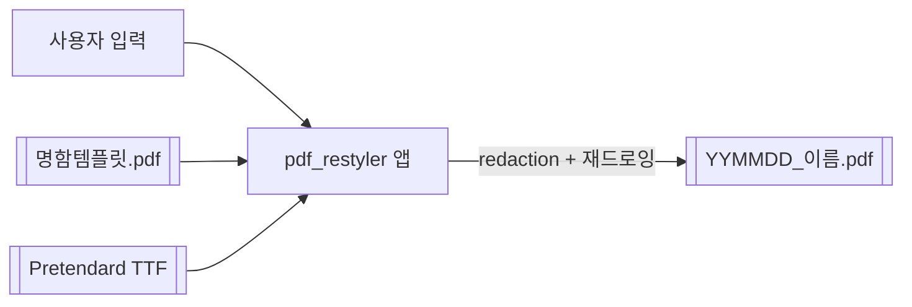

# H SECURITY 명함 생성기 (pdf_restyler)

이름·직급·연락처만 입력하면 **H SECURITY 표준 명함 PDF를 자동 생성**하는 Windows 데스크톱 앱.

> 비개발자도 설치 없이 exe 더블클릭 한 번으로 명함을 만든다. 실사용자 배포 완료.


<!-- 스크린샷: before/after 명함 (추후) -->

## Why

명함 원본 PDF는 글자가 **곡선(아웃라인)** 으로 박혀 있어 텍스트 치환이 안 되고, 흰색으로 덮어도 원본 개인정보가 PDF 내부에 그대로 남는다. 그래서 매번 디자이너에게 수정을 맡겨야 했다. 이 앱은 글자 좌표·색을 추출해 **Pretendard로 다시 그리고**, 원본은 **redaction으로 실제 삭제**해 개인정보 잔존 없이 누구나 직접 명함을 뽑게 한다.

## 주요 기능

| 기능 | 설명 |
|---|---|
| 명함 자동 생성 | 폼 입력 → **대표=핑크 / 직원=검정**(로고 포함) 디자인 자동 분기 |
| 실시간 미리보기 | 입력하는 동안 오른쪽에 결과를 즉시 렌더(150ms 디바운스) |
| 원클릭 저장 | `[PDF로 저장]` → `HSecurity_명함/YYMMDD_이름.pdf`에 다이얼로그 없이 저장 |
| 글자 재구성 | 아웃라인 글자를 좌표·색·자간 그대로 **Pretendard로 재드로잉** |
| 개인정보 제거 | 원본 텍스트를 **redaction(실제 콘텐츠 삭제)** 으로 완전 제거 |
| 빈 항목 자동 생략 | 입력 안 한 연락처(M/T/E 등)는 명함에서 자동으로 빠짐 |

## 시스템 요구사항

| 구분 | 배포 exe 사용 | 소스 실행 / 개발 |
|---|---|---|
| OS | Windows 10/11 **64bit** | 동일 |
| 사전 설치 | **없음** (전부 내장) | Python 3.12 |
| 비고 | 미서명 exe라 첫 실행 시 SmartScreen `추가 정보 → 실행` 안내 필요 | — |

## Quick Start (개발 실행)

```powershell
python -m venv .venv
.venv\Scripts\activate
pip install -r requirements.txt
python main.py
```

## 사용법

1. **구분**(대표/직원) 선택
2. **이름·직급·영어명·별칭·M(휴대폰)·T(전화)·E(이메일)** 입력 — 빈 항목은 자동 생략
3. 오른쪽 **미리보기**로 확인
4. **[PDF로 저장]** → `<exe 폴더>/HSecurity_명함/YYMMDD_이름.pdf`

## 배포 exe 빌드

```powershell
pyinstaller main.py --onefile --windowed --name "HSecurity_명함생성기" `
  --icon assets/chiikawa.ico --add-data "assets;assets" `
  --paths src --hidden-import gui --hidden-import card_generator `
  --collect-all qdarktheme
```

→ `dist/HSecurity_명함생성기.exe` — 파이썬·라이브러리·폰트·템플릿·아이콘 전부 내장. `dist/*.exe` + `docs/자산/사용설명서.pdf` 를 zip으로 묶어 전달한다.

## 파일 입출력 흐름



## 기술 스택

| 영역 | 선택 | 이유 |
|---|---|---|
| 언어 | Python 3.12 | PyMuPDF·PySide6 성숙, 도메인 라이브러리 집중 |
| GUI | **PySide6**(Qt) · qdarktheme | Qt 공식·LGPL, 네이티브 위젯으로 폼·실시간 미리보기 |
| PDF 엔진 | **PyMuPDF**(fitz) | redaction·텍스트 삽입·렌더를 한 라이브러리로 |
| 폰트 | Pretendard(5종) | 원본 미임베드 한글 자형을 하나로 통일 |
| 배포 | **PyInstaller** onefile | 설치 없이 단독 exe 더블클릭 실행 |

## 명함 편집 원리 · 제약

- 명함 규격 **90 × 50 mm** · 색상 핑크 `#EC008C` / 검정 `#000000`
- 원본 폰트를 PDF가 알려주지 않으므로(임베드 0) 자형은 Pretendard로 통일
- **특정 템플릿 전용** — `명함템플릿.pdf` 한 종의 좌표에 맞춰 하드코딩(범용 PDF 편집기 아님)
- 스캔/이미지 PDF·네트워크·코드서명은 범위 밖

## 프로젝트 구조

```
main.py                      진입점(런처)
src/
  card_generator.py          명함 생성 엔진 (CardInfo → PDF)
  gui.py                     PySide6 GUI (입력 폼·미리보기·저장·다크테마)
assets/
  fonts/Pretendard-*.ttf     폰트
  template/명함템플릿.pdf      명함 베이스 (로고·레이아웃만, 개인정보 제거됨)
docs/
  progress.html              작업 로그(요청→처리)
  자산/사용설명서.pdf          비개발자용 매뉴얼
  자산/대표_템플릿.pdf · 직원_템플릿.pdf   샘플(더미값)
```

## 개발 방식

이 프로젝트는 역할별 AI 에이전트 팀(기획·백엔드·프론트엔드·QA·리뷰·보안)을 직접 구성·운영하는 [AI Agent Workspace](https://github.com/muhwa91/ai-agent-workspace) 거버넌스 아래에서 개발·유지보수됩니다 — 훅 기반 품질 게이트, 비공개 모노레포 → 공개 미러 워크플로우.

---
개발 · 제작 : 여중기
